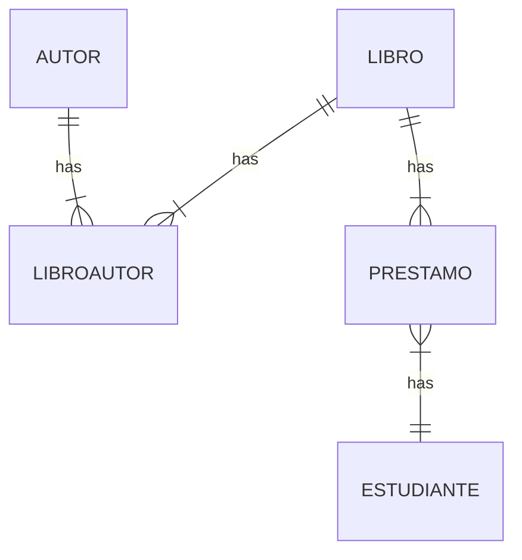

## Consultas SQL Avanzadas
### Ejercicio 1
Se tiene el siguiente DER que corresponde al esquema que presenta la base de datos de una “biblioteca”.



1. **Listar los datos de los autores.**
    ```sql
	SELECT *
    FROM `library`.`authors`;

2. **Listar nombre y edad de los estudiantes**
    ```sql
	SELECT `s`.first_name, `s`.last_name,`s`.age
    FROM `library`.`students` as `s`;

3. **¿Qué estudiantes pertenecen a la carrera informática?**
    ```sql
	SELECT s.*
    FROM library.students s
    WHERE s.carreer = 'Software Engineer';

4. **¿Qué autores son de nacionalidad francesa o italiana?**
    ```sql
	SELECT a.*
    FROM library.authors a
    WHERE nationality IN ('Italian','French');

5. **¿Qué libros no son del área de internet?**
    ```sql
	SELECT *
    FROM books
    WHERE area <> ('Internet');

6. **Listar los libros de la editorial Salamandra.**
    ```sql
	SELECT b.*
    FROM books b
    WHERE b.publisher = 'Salamandra';

7. **Listar los datos de los estudiantes cuya edad es mayor al promedio.**
    ```sql
	SELECT s.*
    FROM students s
    WHERE s.age > (SELECT AVG(s1.age) from students s1);
    
8. **Listar los nombres de los estudiantes cuyo apellido comience con la letra G.**
    ```sql
	SELECT s.first_name
    FROM students s
    WHERE s.last_name LIKE 'G%';

9. **Listar los autores del libro “El Universo: Guía de viaje” (Se debe listar solamente los nombres).**
    ```sql
	SELECT a1.* 
    FROM authors a1 
	INNER JOIN authors_books ab ON a1.id = ab.author_id
	INNER JOIN books b ON b.id = ab.book_id
	WHERE b.title = 'El Universo: Guía de viaje';

10. **¿Qué libros se prestaron al lector “Filippo Galli”?**
    ```sql
	SELECT b.*
    FROM books b
    inner join borrow_students bs
    ON b.id = bs.book_id
    INNER JOIN students s
    ON s.id = bs.student_id
    WHERE s.first_name = 'Filippo' AND s.last_name = 'Galli'; 

11. **Listar el nombre del estudiante de menor edad.**
    ```sql
	SELECT s.first_name, s.last_name
    FROM students s
    ORDER BY age
    limit 1;
    
    SELECT s.first_name, s.last_name
    FROM students s
    WHERE s.age = (SELECT MIN(s1.age) FROM students s1);
    ```
12. **Listar nombres de los estudiantes a los que se prestaron libros de Base de Datos.**
    ```sql
	SELECT b.*
    FROM books b
    inner join borrow_students bs
    ON b.id = bs.book_id
    INNER JOIN students s
    ON s.id = bs.student_id
    WHERE b.area = 'Database';

13. **Listar los libros que pertenecen a la autora J.K. Rowling.**
    ```sql
	SELECT b.*
    FROM books b
    INNER JOIN authors_books ab
    ON b.id = ab.book_id
    INNER JOIN authors a
    ON a.id = ab.author_id
    WHERE a.name = 'J.K. Rowling';

14. **Listar títulos de los libros que debían devolverse el 16/07/2021.**
    ```sql
	SELECT b.title
    FROM books b
    WHERE b.id IN (SELECT bs.book_id 
				   FROM borrow_students bs 
                   WHERE bs.return_date = '2021-07-16')
    ```

#### Ejercicio 2

Implementar la base de datos en PHPMyAdmin o MySQL Workbench, cargar cinco registros en cada tabla y probar algunas consultas planteadas en el Ejercicio

```sql
--
-- Table structure for table `authors`
--

CREATE TABLE `authors` (
  `id` int NOT NULL AUTO_INCREMENT,
  `name` varchar(100) NOT NULL,
  `nationality` varchar(100) NOT NULL,
  PRIMARY KEY (`id`)
) ENGINE=InnoDB AUTO_INCREMENT=10 DEFAULT CHARSET=utf8mb4 COLLATE=utf8mb4_0900_ai_ci;

INSERT INTO `authors` 
VALUES 
(1,'J.K. Rowling','British'),
(2,'George Orwell','British'),
(3,'Haruki Murakami','Japanese'),
(4,'Mark A Garlick','British'),
(5,'Oliver Barry','British'),
(6,'Valerie Stimac','American'),
(7,'Gabriel Garcia Marquez','Colombian'),
(8,'Italo Calvino','Italian'),
(9,'Albert Camus','French');

--
-- Table structure for table `authors_books`
--
CREATE TABLE `authors_books` (
  `author_id` int NOT NULL,
  `book_id` int NOT NULL,
  PRIMARY KEY (`author_id`,`book_id`),
  KEY `idx_authors_books_author_id` (`author_id`),
  KEY `idx_authors_books_book_id` (`book_id`),
  CONSTRAINT `fk_authors_books_author_id` FOREIGN KEY (`author_id`) REFERENCES `authors` (`id`),
  CONSTRAINT `fk_authors_books_book_id` FOREIGN KEY (`book_id`) REFERENCES `books` (`id`)
) ENGINE=InnoDB DEFAULT CHARSET=utf8mb4 COLLATE=utf8mb4_0900_ai_ci;


INSERT INTO `authors_books` 
VALUES 
(1,1),
(2,2),
(3,3),
(3,4),
(3,5),
(4,6),
(5,6),
(6,6);


--
-- Table structure for table `books`
--
CREATE TABLE `books` (
  `id` int NOT NULL AUTO_INCREMENT,
  `title` varchar(100) NOT NULL,
  `publisher` varchar(100) NOT NULL,
  `area` varchar(100) NOT NULL,
  PRIMARY KEY (`id`)
) ENGINE=InnoDB AUTO_INCREMENT=12 DEFAULT CHARSET=utf8mb4 COLLATE=utf8mb4_0900_ai_ci;

INSERT INTO `books` 
VALUES 
(1,'Harry Potter and the Sorcerer Stone','Bloomsbury','Fantasy'),
(2,'1984','Secker & Warburg','Dystopian'),
(3,'Kafka on the Shore','Shinchosha','Magical Realism'),
(4,'The Wind-Up Bird Chronicle','Shinchosha','Magic Realism'),
(5,'1Q84','Shinchosha','Magic Realism'),
(6,'El Universo: Guía de viaje','Planeta','Science'),
(7,'random book','random publisher','random area'),
(8,'Book 1','Salamandra','Fiction'),
(9,'Book 2','Salamandra','Mystery'),
(10,'Database Book 1','Random Publisher','Database'),
(11,'Database Book 2','Another Publisher','Database');

--
-- Table structure for table `borrow_students`
--
CREATE TABLE `borrow_students` (
  `id` int NOT NULL AUTO_INCREMENT,
  `book_id` int NOT NULL,
  `student_id` int NOT NULL,
  `borrow_date` date NOT NULL,
  `return_date` date NOT NULL,
  `returned` tinyint(1) NOT NULL,
  PRIMARY KEY (`id`),
  KEY `idx_books_students_book_id` (`book_id`),
  KEY `idx_books_students_student_id` (`student_id`),
  CONSTRAINT `fk_books_students_book_id` FOREIGN KEY (`book_id`) REFERENCES `books` (`id`),
  CONSTRAINT `fk_books_students_student_id` FOREIGN KEY (`student_id`) REFERENCES `students` (`id`)
) ENGINE=InnoDB AUTO_INCREMENT=13 DEFAULT CHARSET=utf8mb4 COLLATE=utf8mb4_0900_ai_ci;

INSERT INTO `borrow_students` 
VALUES 
(6,1,1,'2021-01-01','2021-07-16',1),
(7,1,2,'2021-02-01','2021-07-06',1),
(8,2,5,'2022-02-01','2022-05-03',0),
(9,3,5,'2022-02-01','2022-05-03',0),
(10,4,5,'2022-02-01','2022-05-03',0),
(11,7,1,'2023-01-01','2023-07-16',1),
(12,8,3,'2023-02-01','2023-07-06',1);
--
-- Table structure for table `students`
--
CREATE TABLE `students` (
  `id` int NOT NULL AUTO_INCREMENT,
  `first_name` varchar(100) NOT NULL,
  `last_name` varchar(100) NOT NULL,
  `address` varchar(100) NOT NULL,
  `carreer` varchar(100) NOT NULL,
  `age` int NOT NULL,
  PRIMARY KEY (`id`)
) ENGINE=InnoDB AUTO_INCREMENT=8 DEFAULT CHARSET=utf8mb4 COLLATE=utf8mb4_0900_ai_ci;

INSERT INTO `students` 
VALUES 
(1,'John','Doe','123 Main St','Computer Science',20),
(2,'Jane','Doe','123 Main St','Software Engineer',21),
(3,'Juan','Perez','123 Calle Principal','Data Scientist',22),
(4,'Maria','Perez','123 Calle Principal','Backend Programmer',23),
(5,'Filippo','Galli','123 Via Principale','Frontend Programmer',24),
(6,'Carlos','Gomez','456 Carrera St','Informatics',25),
(7,'Laura','Hernandez','789 Avenida Principal','Informatics',21);
```